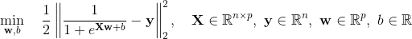

# Fit single logistic response variable in MATLAB

`logisticfit.m` fits a logistic function to minimize the squared error of the reconstruction for a single response variable in MATLAB.

`logisticfit.m` is designed to the halfway point for affine transition regions in phase plots. It performs best with a good initialization. Make a good estimate of the transition slope and intercept and use `logisticfit.m` to refine the estimate.

Because the gradients of the loss function don't admit analytic roots or simple smoothness calculations, multiple local minimizers are found using accelerated gradient descent with backtracking. The coefficients producing the lowest cost is returned.

The main cost of running `logisticfit.m` is the elementwise exponential `exp()` from MATLAB, so some optimizations were made to minimize the number of computations made with `exp()`.